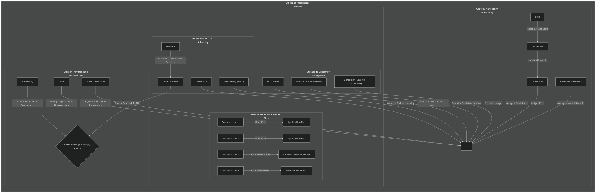

## **Base Layer: OpenStack Nodes on CloudLab**
The base layer involves setting up OpenStack nodes on CloudLab, providing the infrastructure for running the Kubernetes cluster. OpenStack is used as the underlying cloud platform to manage the virtualized resources.

- Provisioning OpenStack nodes on CloudLab
- Setting up networking, storage, and compute resources through OpenStack

# CloudLab Kubernetes Cluster Profile

## **Profile Parameters**
| Parameter                         | Description |
|------------------------------------|-------------|
| **Number of Nodes**                | Can be `1` or `>=3` (default: `3`); Scalable |
| **Hardware Type**                  | Specific machine type for consistency |
| **Experiment Link Speed**          | Sets network speed for cluster interfaces |
| **Disk Image**                     | `UBUNTU22-64-STD` |
| **Kubespray Git Repository**        | `https://github.com/kubernetes-incubator/kubespray.git` |
| **Kubespray Version**              | `release-2.21` |
| **Kubernetes Version**             |  default stable version |
| **Helm Version**                   |  default |
| **Container Manager**              | `docker` (default) or `containerd` |
| **Kubernetes Network Plugin**       | `calico` |
| **Enable MetalLB**                 | `True` |
| **Enable NFS**                     | `True` |
| **Kube Proxy Mode**                | `ipvs` |
| **Kube Master is Worker**          | `False` |
| **Private Docker Registry**        | `True` (exposed on kube master) |

---

## **Architecture Diagram**
Below is the architecture diagram of this Kubernetes setup:

